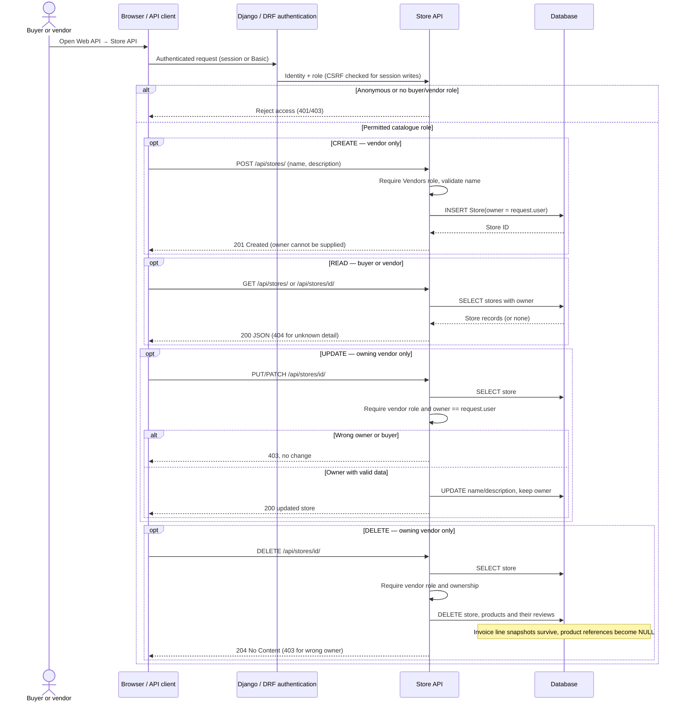
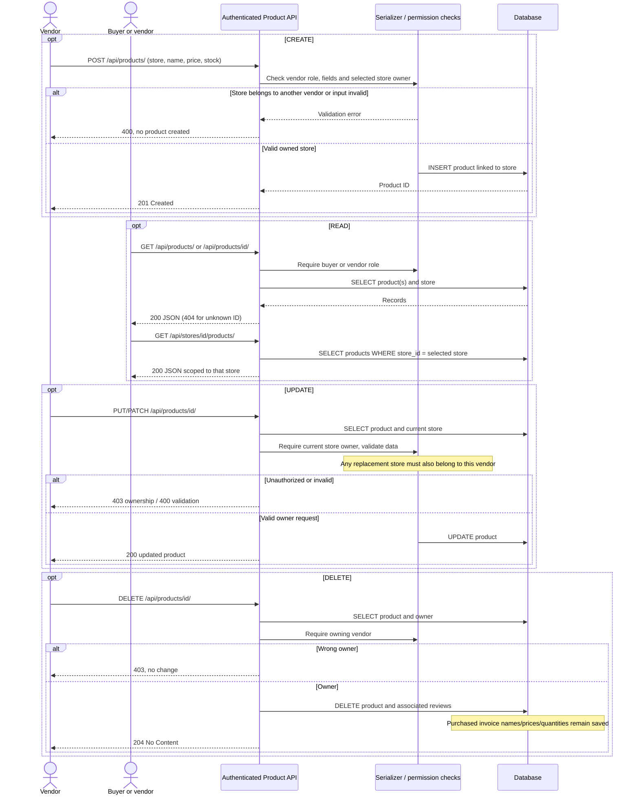
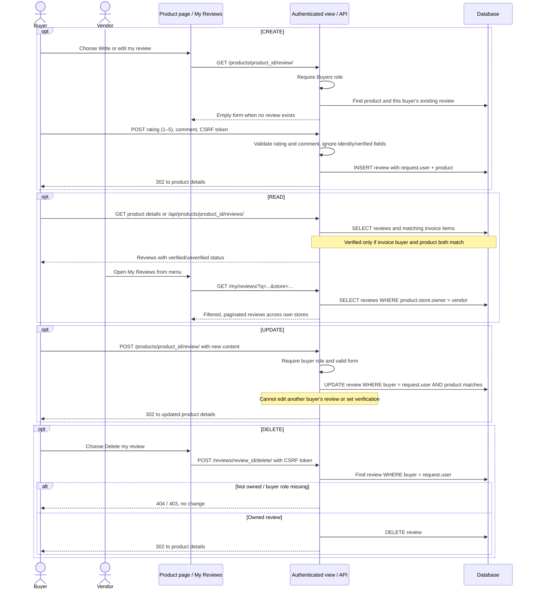

# Task 1 — Store, product and review CRUD sequence diagrams

These sequence diagrams describe the implemented Part 2 routes. GitHub renders the Mermaid blocks directly; open this file on GitHub to see the diagrams. The three diagrams together cover all **12 CRUD use cases**. Each operation is a separate request, not a requirement to create, edit and delete a resource in one visit.

| Resource | Create | Read | Update | Delete |
| --- | --- | --- | --- | --- |
| Store | Vendor: `POST /ecommerce/api/stores/` | Buyer/vendor: `GET /ecommerce/api/stores/` or `<id>/` | Owning vendor: `PUT/PATCH /ecommerce/api/stores/<id>/` | Owning vendor: `DELETE /ecommerce/api/stores/<id>/` |
| Product | Vendor: `POST /ecommerce/api/products/` | Buyer/vendor: `GET /ecommerce/api/products/` or `<id>/` | Owning vendor: `PUT/PATCH /ecommerce/api/products/<id>/` | Owning vendor: `DELETE /ecommerce/api/products/<id>/` |
| Review | Buyer: `POST /ecommerce/products/<id>/review/` | Buyer/vendor: `GET /ecommerce/api/reviews/` | Owning buyer: `POST /ecommerce/products/<id>/review/` | Owning buyer: `POST /ecommerce/reviews/<id>/delete/` |

HTML store/product forms provide equivalent owner-restricted management. Review API endpoints remain read-only; review writes use the authenticated buyer's HTML form. Session-authenticated changes require CSRF tokens. An API access failure returns 401/403; invalid input returns 400. HTML requests redirect anonymous users to login. Ownership-scoped HTML lookups return 404 for another account's resource.

## Resource and endpoint design

The API uses JSON. Store objects expose an ID, name, description and vendor username. Product objects expose their store ID, name, description, decimal price as a string, and stock. Review objects expose the product ID, reviewer username, rating, text, timestamp and a computed verification boolean. Private account fields are excluded. Collection URLs use plural resource names; nested URLs scope stores by vendor and products/reviews by their parent resource. HTML forms handle buyer review writes, while the review API satisfies the brief's retrieval requirement.

## 1. Store CRUD

## 2. Product CRUD

## 3. Review CRUD and purchase verification

All paths above have the `/ecommerce/` prefix (omitted in some arrows for readability). An unverified review is allowed: purchasing is required for the verified label, not for writing feedback. A later successful checkout changes the displayed status automatically.
